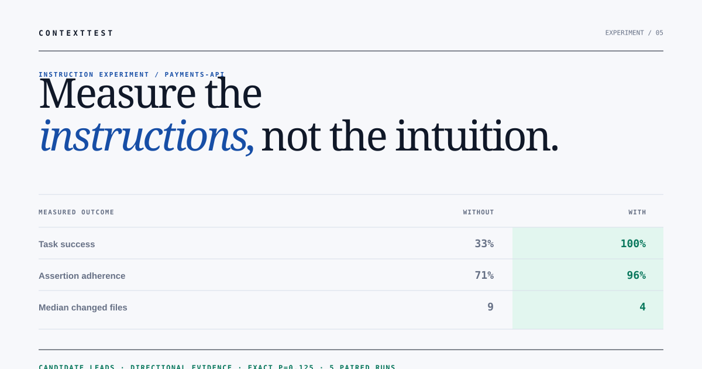
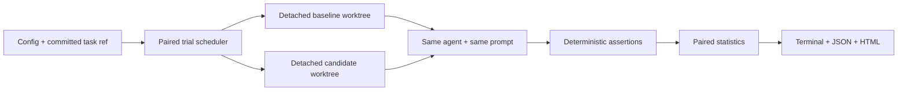

<p align="center">
  
</p>

<p align="center">
  <a href="docs/ARCHITECTURE.md">Architecture</a> ·
  <a href="docs/USE-CASES.md">Use cases</a> ·
  <a href="docs/EXPERIMENT-PLAYBOOK.md">Experiment playbook</a> ·
  <a href="docs/REPORTS.md">Read the reports</a> ·
  <a href="docs/VERIFICATION.md">Verification</a> ·
  <a href="examples/calculator/README.md">Live demonstration</a>
</p>

<h1 align="center">ContextTest</h1>

<p align="center"><strong>Vitest for AGENTS.md.</strong><br>Run the same coding task with two instruction sets. Measure which one actually works.</p>

<p align="center">
  <a href="https://github.com/erickdronski/contexttest/actions/workflows/ci.yml"></a>
  <a href="package.json"></a>
  <a href="LICENSE"></a>
  <a href="SECURITY.md"></a>
</p>

---

You changed `AGENTS.md`. Did the agent get better — or did you add 200 lines of expensive reassurance?

Nobody knows, because nobody measures it. Instruction files are edited by
intuition and defended by anecdote, and the only feedback loop is a vague sense
that things feel better.

ContextTest replaces that with an experiment. It gives Codex or Claude Code the same tasks from the same Git commit, runs each attempt in a detached worktree, verifies the result with deterministic assertions, and produces an evidence-backed comparison.

<p align="center">
  
</p>

**See the proof before installing:** open the committed [standalone HTML report](examples/calculator/output/report.html), inspect its [complete JSON evidence](examples/calculator/output/report.json), or follow the [zero-token demonstration](examples/calculator/README.md). The example is generated by the real worktree and assertion pipeline and guarded by tests.

```text
                         without        with
Task success             33%            100%
95% confidence interval  8%–73%         57%–100%
Assertion adherence      58%            100%
Median duration          6m 42s         4m 18s
Median changed files     9              4
Median diff lines        184            71

VERDICT  WITH LEADS
67 percentage-point difference in task success.
Evidence: directional; 5 paired runs; exact p=0.125.
```

## Why this exists

Repository instructions are executable infrastructure written in prose. They affect which commands agents run, which files they touch, how much context they consume, and whether the result is mergeable. Yet teams commonly review them by eye.

Linters can tell you whether an instruction file is well formed. ContextTest tells you whether it changes behavior.

Use it to answer:

- Does our new `AGENTS.md` improve task completion?
- Is a long section useful or merely consuming context?
- Does Codex respond differently from Claude Code?
- Did an instruction change broaden diffs or increase cost?
- Do nested repository rules work for the tasks they govern?

See the [use-case and decision guide](docs/USE-CASES.md) for concrete experiment designs, adoption patterns, and the questions this tool cannot answer.


### Where this sits

ContextTest measures whether an instruction file changes behavior. Two sibling
tools cover the rest of the loop, and all three are standalone:

| Tool | Job |
|---|---|
| [agentsmith](https://github.com/erickdronski/agentsmith) | **Write** the file — derives an `AGENTS.md` from what your repo actually does, and detects drift in CI |
| **ContextTest** | **Test** it — does the change measurably improve task completion? |
| [burnrate](https://github.com/erickdronski/burnrate) | **Price** it — what the runs cost, with a hard spend cap |
| [tripwire](https://github.com/erickdronski/tripwire) | **Audit** it — what the agent is actually allowed to reach |
| [gtm-skills](https://github.com/erickdronski/gtm-skills) | Go-to-market skills for agents, on a tested arithmetic engine |
| [contexttest-findings](https://github.com/erickdronski/contexttest-findings) | Measured results for common `AGENTS.md` rules, produced with this tool |

The natural sequence is: generate a baseline with `agentsmith`, edit it, prove
the edit with ContextTest, and watch what the experiment costs with `burnrate`.

## How it works



Each task/attempt pair differs only by its instruction treatment. Setup is recorded before agent-change metrics, variant order alternates across attempts, and pairing uses task plus attempt—not completion order. Infrastructure failures invalidate the experiment instead of being counted as model failures.

The [architecture guide](docs/ARCHITECTURE.md) maps every component, lifecycle transition, trust boundary, extension surface, and report field.

## Tested as an evaluator should be

The public suite covers provider contracts, all assertion families, statistics, report escaping, configuration rejection, secret handling, timeout cleanup, symlink boundaries, concurrent worktree lifecycle, documentation links, golden-report regeneration, clean tarball installation, and the GitHub Action entrypoint.

CI runs the check and installation smoke test on Node 20, 22, and 24, plus an Action-specific end-to-end job. See the [verification and test map](docs/VERIFICATION.md) for the claim-to-test index, exact commands, release gates, and honest limits.

## Quick start

Requirements: Node.js 20.11+, Git, and either Codex CLI or Claude Code installed and authenticated.

```bash
npx github:erickdronski/contexttest init
```

Installing from the git URL is the supported path today — this is not on npm
yet. When it is published the package name will be `@erickdronski/contexttest`.


Edit the generated `contexttest.json` and `AGENTS.candidate.md`, then run:

```bash
npx github:erickdronski/contexttest doctor
npx github:erickdronski/contexttest run --attempts 5
```

ContextTest writes two artifacts under `.contexttest/reports/<run>/`:

- `report.html` — a private, standalone experiment report
- `report.json` — the complete machine-readable evidence record

No account, server, database, or telemetry is involved. Reports remain local, but failed-run diagnostics can contain source excerpts, paths, or agent output. Inspect them before sharing.

## Make sure the agent actually reads your instructions

An experiment means nothing if the treatment never reaches the agent—and agents do not all read the same file.

| Agent | Loads on its own | With `instructionFile: "AGENTS.md"`, ContextTest… |
|---|---|---|
| Codex | `AGENTS.md` | writes the variant's file; Codex reads it natively |
| Claude Code | `CLAUDE.md`—**not** `AGENTS.md` | also writes a `CLAUDE.md` containing `@AGENTS.md` into every arm, so Claude Code imports the file under test |
| `command` | whatever your agent reads | writes the file; delivery is your agent's responsibility |

Before 0.3.0, Claude Code experiments with the default `AGENTS.md` never delivered the treatment: both arms were identical and every difference was noise. The bridge is now written into every arm—including the arm without instructions, where its import has no target—so only the imported file differs. It is written before the trial baseline and never counts as an agent change. A repository that already has a `CLAUDE.md` keeps it in every arm and gains the import line; `contexttest doctor` warns about this, because those rules also reach your baseline.

For any other file name ContextTest cannot know whether the agent reads it, and both `doctor` and the report say so. If Claude Code exits before its first turn—for example because it does not recognize the configured model—the experiment is invalid rather than scored as agent failures.

Every report also runs a passive delivery check. Instructions travel with every model request, so the arm with more instruction text should send more input tokens per request—roughly one token per four bytes of difference. When the observed difference is below a quarter of that, the report marks treatment delivery `doubtful`, prints a warning above the verdict, and withholds every confident evidence label. When the agent reports no usage, or usage varies between trials more than the treatment could explain, the check says `unknown` instead of guessing.

### Keep your own agent setup out of the experiment

By default the agent runs with everything installed on the experimenter's machine. Claude Code loads user settings, plugins, hooks, skills, and MCP servers into every trial; Codex applies `~/.codex/config.toml`. That makes results depend on whose laptop ran them, and a large personal setup can dwarf the instruction file being tested. Set `"isolate": true` on the agent:

| Agent | `isolate: true` adds |
|---|---|
| Claude Code | `--strict-mcp-config --setting-sources project,local`: no MCP servers unless the project declares them, no user settings, plugins, or hooks |
| Codex | `--ignore-user-config` |

In a Claude Code canary run, isolation cut per-request input from about 51,000 tokens to about 27,600 and roughly halved cost, while the project's instructions were still delivered. Isolation narrows machine-specific state; it is not a sandbox, and other user-level state such as credentials still applies. Every report records the exact command-line flags per variant (with the prompt and worktree as placeholders) and the agent's `--version` output, because agent behavior changes between CLI releases. `contexttest doctor` warns when a Codex or Claude Code experiment is not isolated.

## A complete experiment

```json
{
  "$schema": "https://raw.githubusercontent.com/erickdronski/contexttest/main/schema/contexttest.schema.json",
  "version": 1,
  "project": "payments-api",
  "baseRef": "HEAD",
  "instructionFile": "AGENTS.md",
  "agent": {
    "provider": "codex",
    "timeoutMinutes": 20
  },
  "trials": {
    "attempts": 5,
    "concurrency": 2
  },
  "setup": {
    "commands": [["npm", "ci", "--ignore-scripts"]],
    "timeoutMinutes": 10
  },
  "environment": {
    "inherit": false,
    "allow": []
  },
  "variants": [
    { "name": "without", "disabled": true },
    { "name": "with", "source": "AGENTS.candidate.md" }
  ],
  "tasks": [
    {
      "name": "preserve-public-api",
      "prompt": "Fix pagination when the cursor points to a deleted record.",
      "assertions": [
        { "type": "command", "command": ["npm", "test"] },
        { "type": "allowedPaths", "patterns": ["src/**", "test/**"] },
        { "type": "forbiddenPaths", "patterns": ["src/public-api/**"] },
        { "type": "maxChangedFiles", "value": 8 },
        { "type": "maxDiffLines", "value": 250 }
      ]
    }
  ]
}
```

Variant paths are relative to the configuration file. Task commands and assertion paths run from the repository root inside each trial worktree.

Setup commands run in every fresh worktree before the trial baseline is recorded. Use them for dependencies, generated fixtures, or other preparation that every variant needs. Their filesystem changes are excluded from agent metrics; a setup failure invalidates the experiment instead of counting as an agent failure.

ContextTest always evaluates committed Git content. `contexttest doctor` warns when your working tree is dirty because uncommitted product code, tasks, or instruction files will not be present in detached trial worktrees.

## Design an experiment worth trusting

1. Change one instruction idea at a time. A candidate that rewrites everything may win, but it will not tell you why.
2. Choose three to ten tasks that represent recurring repository work: a bug fix, a constrained refactor, a test addition, or a documentation change with executable checks.
3. Write prompts that describe the job, not the expected patch. Both variants must receive exactly the same prompt.
4. Prefer assertions that encode mergeability: targeted tests, allowed paths, protected public APIs, and bounded diffs.
5. Start with one attempt to debug the harness. Move to at least five paired runs for a directional comparison and more when the decision matters.
6. Re-run on another commit or day before turning a result into permanent repository policy.

Historical bugs make strong tasks when you reset to the parent of the fixing commit and write assertions from the regression test. Never include the original fix in the worktree being evaluated.

For a complete workflow—from decision statement through task selection, failure classification, sample sizing, and review checklist—use the [experiment playbook](docs/EXPERIMENT-PLAYBOOK.md).

## Commands

```bash
contexttest init                         # create a starter experiment
contexttest run                          # run every configured task
contexttest run --task pagination        # run one task
contexttest run --attempts 10            # override repetitions
contexttest run --keep-worktrees         # retain trial worktrees for debugging
contexttest run --json                   # emit the report as one JSON line
contexttest doctor                       # verify config, refs, files, tools, and Git state
contexttest report path/report.json      # regenerate the HTML report
```

Exit codes:

| Code | Meaning |
|---:|---|
| `0` | Candidate leads or there is no clear winner |
| `1` | Configuration or infrastructure failure |
| `2` | Baseline leads; useful as a CI regression gate |

## Assertions

Every run implicitly asserts that the agent exits successfully. Add deterministic checks for the behavior that matters:

| Type | Purpose |
|---|---|
| `command` | Run an argument-array command and check its exit code or timeout |
| `maxChangedFiles` / `minChangedFiles` | Bound the size of the change |
| `maxDiffLines` | Bound added and deleted lines |
| `allowedPaths` | Require every changed path to match a glob |
| `forbiddenPaths` | Reject changes matching a glob |
| `requiredFile` / `forbiddenFile` | Check filesystem outcomes |
| `fileContains` | Check a specific file for literal text |
| `stdoutContains` / `stdoutNotContains` | Check the agent's final output |

ContextTest supports `*`, `**`, and `?` in path globs.

Give command assertions a safe display label when their arguments contain sensitive or noisy values:

```json
{ "type": "command", "label": "unit tests", "command": ["npm", "test"], "timeoutMinutes": 10 }
```

## Agent providers

### Codex

```json
{ "provider": "codex", "model": "optional-model", "isolate": true, "timeoutMinutes": 20 }
```

ContextTest uses `codex exec --ephemeral --sandbox workspace-write --json`. It never passes Codex's sandbox-bypass flag.

### Claude Code

```json
{
  "provider": "claude",
  "permissionMode": "acceptEdits",
  "maxTurns": 30,
  "isolate": true,
  "timeoutMinutes": 20
}
```

ContextTest uses non-interactive print mode. `acceptEdits` is the default; bypassing permissions requires an explicit configuration change and is strongly discouraged outside an external sandbox. Claude Code reads `CLAUDE.md`, so an `AGENTS.md` treatment is delivered through a `CLAUDE.md` import; see [Make sure the agent actually reads your instructions](#make-sure-the-agent-actually-reads-your-instructions).

### Any command

```json
{
  "provider": "command",
  "command": ["my-agent", "run", "--cwd", "{cwd}", "--prompt", "{prompt}"]
}
```

Arguments are spawned directly—not passed through a shell. `{cwd}` and `{prompt}` are substituted as complete arguments.

## GitHub Action

```yaml
name: Agent instruction regression
on:
  pull_request:
    paths:
      - AGENTS.md
      - contexttest.json

jobs:
  contexttest:
    runs-on: ubuntu-latest
    permissions:
      contents: read
    steps:
      - uses: actions/checkout@v7
        with:
          fetch-depth: 0
      - uses: actions/setup-node@v7
        with:
          node-version: 20
      - uses: erickdronski/contexttest@v0
        id: experiment
        with:
          attempts: 5
      - uses: actions/upload-artifact@v7
        if: always()
        with:
          name: contexttest-report
          path: contexttest-report/
```

Authentication must be configured for the selected agent in your workflow. ContextTest intentionally does not invent or persist credentials.

## Safety model

Running an autonomous coding agent executes model-generated actions. A Git worktree protects your working copy from accidental edits, but it is not a security boundary.

ContextTest therefore:

- Uses detached worktrees and removes them after each run
- Never enables permission or sandbox bypass by default
- Offers `agent.isolate` to keep user-level agent plugins, hooks, settings, and MCP servers out of trials
- Strips environment variables except a small runtime allowlist
- Requires explicit opt-in for API keys and other credentials
- Redacts common token formats and allowlisted secret values from reports
- Redacts agent output and assertion-command diagnostics before they enter reports
- Avoids shell interpolation for agent and assertion commands
- Bounds retained output and subprocess runtime
- Refuses to delete paths outside its generated worktree directory

For untrusted repositories, prompts, models, or MCP servers, run ContextTest inside a disposable VM or container. Read [SECURITY.md](SECURITY.md) before using it in CI with credentials.

Redaction is defense in depth, not a guarantee. ContextTest excludes the configured task prompt from report metadata, but an agent or failing command may repeat sensitive content in its output.

## Interpreting results

Coding-agent behavior is stochastic. One run is a story, not a measurement.

- Each baseline run is paired with the candidate run for the same task and attempt.
- Pass rates include Wilson 95% confidence intervals.
- Pass/fail disagreements use a two-sided exact paired test; the report exposes its p-value instead of hiding uncertainty behind a score.
- `1–2` pairs are labeled anecdotal and `3–4` early regardless of effect size.
- At five or more pairs, evidence remains directional until the paired p-value is at most `0.05`; `p ≤ 0.01` is labeled strong.
- When token usage suggests the treatment never reached the agent, the label is `doubtful` regardless of sample size or p-value.

The verdict is a practical leader, not a universal truth. It first considers a material task-success difference, then assertion adherence, then duration only when success is equal. The report also breaks results down by task so an aggregate win cannot quietly hide a task-specific regression. Tasks should represent real repository work, assertions should be deterministic, and conclusions should be replicated across repositories or task families.

The JSON report records resolved task commits, a configuration digest, runtime metadata, setup count, every trial, and the paired contingency table. It deliberately excludes prompts and instruction contents.

## Experimental limits

Detached worktrees isolate repository changes, not the rest of the machine. Agent accounts, provider availability, network responses, package caches, MCP servers, agent CLI releases, and model versions can all change between runs; `agent.isolate` removes the user-level agent setup, and reports record the agent's version. Concurrency can also introduce shared-cache contention. Use low concurrency for latency comparisons, pin models where providers allow it, keep setup deterministic, and replicate important conclusions on another day.

## Deterministic demo

The repository includes a mock-agent experiment so the complete worktree, assertion, statistics, and reporting pipeline can be tested without spending tokens:

```bash
npm run demo
```

Expected outcome: three baseline trials fail the repository behavior check, three candidate trials pass, and ContextTest produces a paired verdict plus JSON and HTML artifacts.

The complete [calculator walkthrough](examples/calculator/README.md) maps the treatment, fixture, assertions, expected failure, and every output file. Its [committed HTML](examples/calculator/output/report.html) and [JSON](examples/calculator/output/report.json) let users inspect the result before running anything.

The mock is only a product demonstration. It is clearly identified as such and must never be presented as evidence about a real model. Maintainers can regenerate the portable golden artifacts with `npm run demo:update`; tests require the committed HTML to match the JSON reporter byte for byte.

## Project status

ContextTest is an early public release. Its report schema is versioned; the configuration format may gain additive fields before `1.0`. Current priorities are documented in [ROADMAP.md](ROADMAP.md).

If this solves a real problem for you, run an experiment and share the anonymized result—not just a star. Reproducible examples are the fastest way to make this project trustworthy.

## Contributing

Start with [CONTRIBUTING.md](CONTRIBUTING.md). Security issues belong in the private process described in [SECURITY.md](SECURITY.md). The project follows the [Contributor Covenant](CODE_OF_CONDUCT.md).

MIT © Erick Dronski
