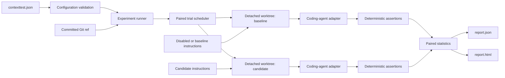
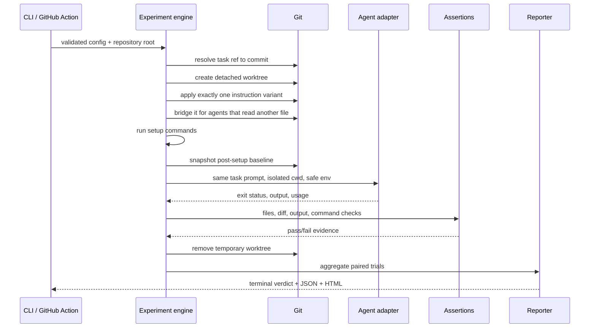
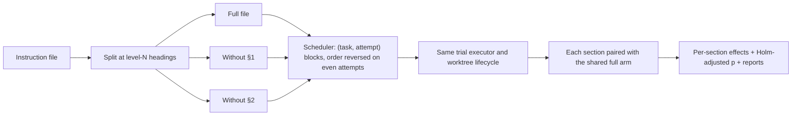

# Architecture

ContextTest is a local-first experiment runner for repository instructions. It is deliberately a small orchestration layer around Git, a coding-agent CLI, deterministic assertions, and a pair of reports.

The central guarantee is comparability: for a given task and attempt, both instruction variants start from the same committed source and receive the same prompt. The instruction file is the treatment; everything else should stay fixed.

## System map



## One trial, step by step



Setup happens before the trial baseline is recorded, so dependency installation or fixture generation is not attributed to the agent's changed-file and diff metrics.

The bridge step exists because agents load different files on their own. Claude Code reads `CLAUDE.md`, not `AGENTS.md`, so for an `AGENTS.md` treatment every Claude Code arm—with or without instructions—gets the same `CLAUDE.md` import line. Like the instruction file itself, the bridge is part of the trial baseline, not of the agent's change. An agent that exits before its first turn, or an executable that cannot start, is an infrastructure failure: the experiment is invalidated instead of scoring a run that never happened.

## Components and responsibilities

| Component | Responsibility | Important boundary |
|---|---|---|
| `src/cli.mjs` | `init`, `doctor`, `run`, `ablate`, and `report` commands | Converts user input into validated engine calls and stable exit codes; refuses value flags without values |
| `src/lib/config.mjs` | Discovery, starter config, structural and safety validation, per-variant agent resolution | Rejects malformed or unsafe experiments—including unknown variant keys—before paid agent runs |
| `src/lib/engine.mjs` | Run preparation, scheduling, worktree lifecycle, pairing, artifact assembly | Alternates arm order by attempt, optionally shuffles blocks by seed, and invalidates infrastructure failures |
| `src/lib/sections.mjs` | Splitting an instruction file at one heading level; removing exactly one section | Pure text functions; byte-exact reconstruction |
| `src/lib/ablation.mjs` | Ablation planning, budget, shared full arm, per-section effects | Reuses the engine's scheduler and trial executor—no second worktree lifecycle |
| `src/lib/git.mjs` | Commit resolution, detached worktrees, variant application, delivery bridges, diff metrics | Refuses unsafe deletion and path/symlink escapes, including through an existing `CLAUDE.md` |
| `src/lib/adapters.mjs` | Codex, Claude Code, custom-command, and mock execution; which instruction files each agent reads; runs that never started | Spawns argument arrays directly; no shell interpolation |
| `src/lib/assertions.mjs` | Executable, filesystem, path, diff, and output checks | A task passes only when the agent and every assertion pass |
| `src/lib/stats.mjs` | Summaries, Wilson intervals, paired exact test, treatment-delivery check, verdict | Exposes uncertainty instead of collapsing evidence into one opaque score; withholds confident labels when the treatment may not have arrived |
| `src/lib/reporter.mjs` | Terminal, standalone HTML, and report regeneration for every report kind | Escapes embedded data; refuses unknown kinds and newer schema versions; reports remain portable files |
| `src/action.mjs` | GitHub Action input/output adapter | Writes escaped multiline outputs and copies artifacts to the requested directory |

## Data model

```text
Experiment
├── resolved task refs
├── two variants: an instruction treatment plus the agent that receives it
├── one or more tasks
│   ├── prompt (used at runtime, omitted from reports)
│   └── deterministic assertions
├── N paired attempts per task
│   ├── baseline trial
│   └── candidate trial
└── reports
    ├── aggregate variant summaries, each with its agent
    ├── what differed between the arms: instructions, agent, both, or neither
    ├── task-level summaries
    ├── paired contingency table and exact p-value
    ├── treatment-delivery check from token usage
    └── trial evidence: checks, files, diff, usage, diagnostics
```

The JSON report is the evidence record. The HTML report is a standalone presentation of the same record. The configured prompts and instruction contents are intentionally not copied into either artifact.

## Trust boundaries

A detached worktree protects the developer's working copy from ordinary edits. It is not a sandbox. An autonomous agent can still use its process permissions, network access, credentials, caches, and external tools.

ContextTest reduces accidental exposure by default:

- a minimal inherited environment unless variables are explicitly allowed;
- no shell interpolation for agent, setup, or assertion commands;
- no permission-bypass flags in the default Codex or Claude Code adapters;
- bounded process time and retained output;
- token-pattern and configured-secret redaction before report persistence;
- realpath and symlink checks around state, variants, delivery bridges, assertions, and cleanup;
- infrastructure failures invalidate the experiment instead of becoming false agent failures.

For untrusted code, prompts, models, or MCP servers, put the entire run inside a disposable VM or container. See [SECURITY.md](../SECURITY.md) for the operational threat model.

## Concurrency and pairing

Jobs are generated as `(task, attempt, variant)` tuples. Odd attempts schedule baseline then candidate; even attempts reverse that order. With `trials.seed` (or `--seed`), the `(task, attempt)` blocks run in a reproducible random order—a seeded mulberry32 generator and a Fisher–Yates shuffle—while each block keeps both variants back to back and the alternation by attempt. The pool limits simultaneous trials to the configured concurrency. This reduces systematic ordering bias, but it cannot remove provider drift or shared-cache contention.

Statistical pairing is by task name and attempt number—not by completion order. The exact paired test considers only disagreements: cases where one variant passes and the other fails.

## Ablation runs

`contexttest ablate` reuses the same machinery with more than two arms. The planner reads the chosen variant's instruction file through the same containment checks as `applyVariant`, splits it at one heading level, and builds one arm for the full file plus one arm per selected section with that section removed. Every arm is an inline-content variant, so instruction writes and any Claude Code bridge go through the usual path.



Within a task and attempt, all arms run back to back; their order reverses on even attempts so every pair of arms is balanced. The full arm runs once per task and attempt and serves every comparison.

## Extension surfaces

You can extend ContextTest without forking the runner:

- use `agent.provider: "command"` to invoke any non-interactive agent through an argument-array command;
- add task-specific assertions to encode a repository's definition of mergeable;
- consume `report.json` from dashboards or CI policy;
- import the public Node API from `@erickdronski/contexttest` for custom orchestration;
- regenerate HTML from any stored JSON report—experiment or ablation—with `contexttest report`.

The public API exports configuration helpers, the experiment and ablation runners, the section splitter, the reporters, and the paired-statistics functions. The configuration schema is published at [`schema/contexttest.schema.json`](../schema/contexttest.schema.json).

## Repository layout

```text
contexttest/
├── src/                       CLI, Action entrypoint, and library modules
├── schema/                    machine-readable configuration schema
├── test/                      unit, integration, security, and documentation tests
├── examples/calculator/       deterministic zero-token demonstration
├── examples/ablation/         deterministic section-ablation demonstration
├── docs/                      architecture, use cases, reports, and experiment playbook
├── scripts/                   lint, package smoke, and example-output tooling
├── action.yml                 GitHub Action contract
└── README.md                  product overview and quickest path to value
```

## Design constraints

ContextTest is intentionally not a model-serving platform, prompt registry, tracing backend, or security sandbox. It has no account system, database, telemetry collector, or hosted control plane. That keeps the causal surface small and makes an experiment reproducible from a Git commit, a config file, and an authenticated agent CLI.
