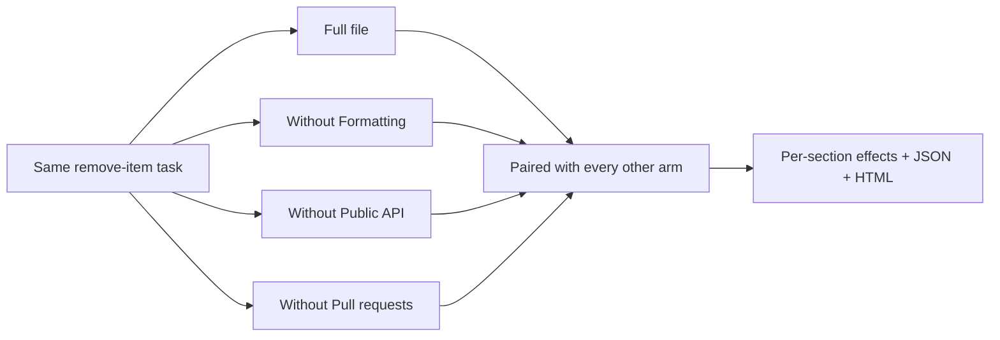

# Deterministic ablation demonstration

This example asks the question an ablation exists for: which sections of an instruction file actually change behavior? It runs the complete ablation pipeline with a mock agent, so it costs no tokens and gives the same answer every time.

## What it demonstrates

[`AGENTS.candidate.md`](AGENTS.candidate.md) has a short preamble and three sections: **Formatting**, **Public API**, and **Pull requests**. The [mock agent](mock-agent.mjs) reads all three, but only the Public API rule changes what it does: with it, the agent adds `removeItem` beside the existing `addItem` export; without it, the agent rewrites the module and `addItem` disappears.



The full arm runs once per task and attempt and is shared by all three comparisons: 4 arms × 1 task × 3 attempts is 12 agent runs, where three separate A/B experiments would need 18.

## Run it

From the repository root:

```bash
npm run demo:ablate
```

ContextTest prints the section outline and the run budget before starting. Expected result:

```text
Section           Lines  Without  Δ success  Δ adherence  Δ duration  Δ diff lines  Reading          Evidence
§1 Formatting     5      100%     0 pp       0 pp         0ms         0             no clear effect  early · p=1.000
§2 Public API     5      0%       +100 pp    +20 pp       0ms         0             helps            early · p=0.250 (Holm 0.750)
§3 Pull requests  4      100%     0 pp       0 pp         0ms         0             no clear effect  early · p=1.000
```

Durations in a live run vary with the machine; the committed report normalizes them. Readings never come from duration alone, so timing noise cannot make a section look helpful or harmful.

Two things in that table are deliberate caution, not timidity. Three attempts per arm is early evidence, so even a 100-point effect has an exact paired p-value of 0.25—and 0.75 after Holm's adjustment for testing three sections at once. And "no clear effect" for Formatting and Pull requests means those sections are untested at this sample size, not that they are useless. In this example they genuinely do nothing; with a real agent you would need more attempts before deleting them.

## Inspect it before running

- [`contexttest.json`](contexttest.json) — the configuration; `ablate` uses the variant with instructions
- [`AGENTS.candidate.md`](AGENTS.candidate.md) — the file being ablated
- [`mock-agent.mjs`](mock-agent.mjs) — deterministic stand-in for an agent
- [`fixture/inventory.mjs`](fixture/inventory.mjs) and [`fixture/verify.mjs`](fixture/verify.mjs) — starting code and its behavior check
- [`output/report.json`](output/report.json) and [`output/report.html`](output/report.html) — the committed ablation report

`npm run demo:update` regenerates the committed report from a real run. Tests require the HTML to match `contexttest report output/report.json` byte for byte. Like every mock example, this demonstrates the pipeline and is never evidence about a real coding agent.
