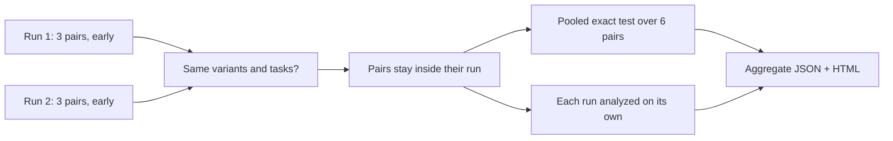

# Deterministic aggregation demonstration

A three-attempt run is early evidence at best. Rerunning old trials to grow the sample wastes money; `contexttest aggregate` pools the reports you already have instead. This example pools two independent runs of the [calculator experiment](../calculator/README.md).

## What it demonstrates



- Both source runs are complete experiment reports, committed under [`runs/`](runs/first/report.json).
- Attempts are renumbered per run, so the pooled test never pairs a baseline from one run with a candidate from another.
- Each run alone is early evidence (exact p=0.250); pooled, the same six disagreements reach exact p=0.031—convincing.
- The source breakdown keeps both runs visible, so a run that pointed the other way could not be averaged away.

## Run it

From the repository root:

```bash
npm run demo:aggregate
```

That is `contexttest aggregate examples/aggregate/runs/first/report.json examples/aggregate/runs/second/report.json`. Expected result:

```text
VERDICT  WITH-INSTRUCTIONS
100 percentage-point difference in task success.
Only the instructions differ; both arms use mock.
Evidence: convincing; 6 paired run(s) across 2 source runs; exact p=0.031.

SOURCE RUNS
Run                    Version  Commit    Pairs  without-instructions  with-instructions  Δ success  Evidence
calculator-demo-run-1  0.3.0    00000000  3      0%                    100%               +100 pp    early · p=0.250
calculator-demo-run-2  0.3.0    00000000  3      0%                    100%               +100 pp    early · p=0.250
No run contradicts another: 2 favour with-instructions.
```

## What this example cannot show

Two runs of a deterministic mock agree perfectly; real runs rarely do. Pooling assumes the runs measured the same thing. When source runs differ in configuration digest, agent or model, instruction digest, task refs, project, or ContextTest version, the aggregate still pools them—growing a sample over time is the point—but records a warning for each difference. Runs whose leaders disagree produce a heterogeneity warning. Pooling refuses outright when variant names, their order, or the task set differ, or when the same run appears twice.

## Inspect it before running

- [`runs/first/report.json`](runs/first/report.json) and [`runs/second/report.json`](runs/second/report.json) — the source experiment reports
- [`output/report.json`](output/report.json) — the aggregate evidence record, including compact trials and the per-run breakdown
- [`output/report.html`](output/report.html) — the standalone aggregate report

`npm run demo:update` regenerates the source runs and the aggregate from real executions. Tests require every committed HTML file to match `contexttest report` byte for byte. This is a product demonstration, never evidence about a real coding agent.
