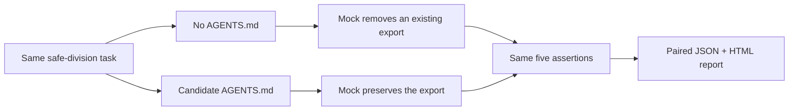

# Deterministic calculator demonstration

This example runs the complete ContextTest pipeline without calling a real model or spending tokens. A tiny deterministic mock agent receives the same safe-division task with and without a candidate instruction file.

## What it demonstrates



The mock intentionally behaves differently when it can read the candidate instructions. This proves orchestration—not model quality:

- both variants begin at the same Git commit;
- each attempt gets a detached worktree;
- the instruction treatment is applied before agent execution;
- a repository test checks behavior;
- path and diff limits check patch scope;
- pass/fail outcomes are paired by attempt;
- JSON and standalone HTML reports are produced.

## Run it

From the repository root:

```bash
npm run demo
```

Expected result: all three `without-instructions` trials fail the behavior check, all three `with-instructions` trials pass, and the terminal verdict says the candidate leads with early evidence.

No Codex or Claude Code authentication is required because the configuration uses the internal `mock` provider. The mock provider exists for tests and demonstrations; real experiments should use `codex`, `claude`, or `command`.

## Inspect it before running

- [`contexttest.json`](contexttest.json) — complete experiment configuration
- [`AGENTS.candidate.md`](AGENTS.candidate.md) — the treatment
- [`mock-agent.mjs`](mock-agent.mjs) — deterministic stand-in for an agent
- [`fixture/calculator.mjs`](fixture/calculator.mjs) — starting repository code
- [`fixture/verify.mjs`](fixture/verify.mjs) — executable behavior check
- [`output/report.json`](output/report.json) — committed evidence record
- [`output/report.html`](output/report.html) — committed standalone report

## Why the baseline fails

The requested `safeDivide` function is not enough by itself. The starting module already exports `add`, and the verification file requires both exports. The baseline mock makes the new function work but accidentally deletes `add`. The candidate instructions explicitly require preserving existing exports, so the treated mock produces a mergeable patch.

That distinction illustrates an important experiment-design principle: task success should encode repository constraints, not merely whether the new behavior appears.

## Output provenance

`npm run demo:update` executes the demo, then normalizes timestamps, commit IDs, platform metadata, paths, and small timing variations so the checked-in example remains portable and reviewable. Pass/fail outcomes, assertion results, changed files, diff metrics, paired statistics, and the verdict come from the executable run.

The golden JSON and HTML are tested for internal consistency and byte-for-byte report regeneration. They are a product demonstration, never evidence about a real coding agent.
